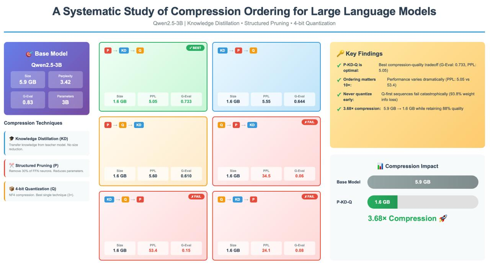

# A-Systematic-Study-of-Compression-Ordering-for-Large-Language-Models

# A Systematic Study of Compression Ordering for Large Language Models

[](https://arxiv.org/abs/2511.19495)
[](https://huggingface.co/Shivansh19273/models)
[](LICENSE)

Official implementation of **"A Systematic Study of Compression Ordering for Large Language Models"**

## 📋 Overview

This repository contains the code and models for our systematic study on compression technique ordering for Large Language Models. We investigate how different orderings of **Knowledge Distillation (KD)**, **Structured Pruning (P)**, and **4-bit Quantization (Q)** affect model quality and compression ratio.

### Key Findings

- ✅ **P-KD-Q is optimal**: Prune → Distill → Quantize achieves the best compression-quality tradeoff
- ⚠️ **Never quantize early**: Q-first sequences fail catastrophically (10× worse perplexity)
- 📊 **3.68× compression**: From 5.9 GB to 1.6 GB while retaining 88% quality
- 🎯 **Ordering matters**: Performance varies 10× based solely on compression order

## 🚀 Quick Start

### Installation
```bash
git clone https://github.com/shivansh980/A-Systematic-Study-of-Compression-Ordering-for-Large-Language-Models.git
cd A-Systematic-Study-of-Compression-Ordering-for-Large-Language-Models

# Install dependencies
pip install -r requirements.txt
```

### Download Models

All compressed models are available on Hugging Face:

**Single-Technique Models:**
- [Qwen-Distilled](https://huggingface.co/Shivansh19273/Qwen-Distilled) - Knowledge Distillation only
- [Qwen-Pruned](https://huggingface.co/Shivansh19273/Qwen-Pruned) - Structured Pruning only
- [Qwen-Lora-quantized](https://huggingface.co/Shivansh19273/Qwen-Lora-quantized) - 4-bit Quantization only

**Three-Technique Models (Top 3):**
- [Qwen2.5-3B-P-KD-Q](https://huggingface.co/Shivansh19273/Qwen-Pruned-Distilled-Quantized) - **Best** (G-Eval: 0.733, PPL: 5.05)
- [Qwen2.5-3B-KD-P-Q](https://huggingface.co/Shivansh19273/Qwen-Distilled-Pruned-Quantized) - Second best (G-Eval: 0.644, PPL: 5.55)


### Usage

#### Load a Compressed Model
```python
from transformers import AutoModelForCausalLM, AutoTokenizer

# Load the best model (P-KD-Q)
model = AutoModelForCausalLM.from_pretrained(
    "Shivansh19273/Qwen-Pruned-Distilled-Quantized",
    device_map="auto"
)
tokenizer = AutoTokenizer.from_pretrained("Shivansh19273/Qwen-Pruned-Distilled-Quantized")

# Generate text
prompt = "What is machine learning?"
inputs = tokenizer(prompt, return_tensors="pt").to(model.device)
outputs = model.generate(**inputs, max_new_tokens=100)
print(tokenizer.decode(outputs[0], skip_special_tokens=True))
```


## 📊 Results

### Performance Comparison

| Model | Size (GB) | Perplexity ↓ | G-Eval ↑ | Compression |
|-------|-----------|--------------|----------|-------------|
| **Base (Qwen2.5-3B)** | 5.90 | 3.42 | 0.830 | 1.0× |
| **Single Techniques** |
| KD | 5.90 | 3.23 | 0.790 | 1.0× |
| P | 4.49 | 5.09 | 0.650 | 1.31× |
| Q | 1.96 | 3.96 | 0.540 | 3.00× |
| **Three Techniques** |
| **P-KD-Q** ✓ | **1.60** | **5.05** | **0.733** | **3.68×** |
| KD-P-Q | 1.60 | 5.55 | 0.644 | 3.68× |
| P-Q-KD | 1.60 | 5.60 | 0.610 | 3.68× |
| Q-P-KD ✗ | 1.60 | 34.49 | 0.060 | 3.68× |
| Q-KD-P ✗ | 1.60 | 24.07 | 0.080 | 3.68× |
| KD-Q-P ✗ | 1.60 | 53.37 | 0.146 | 3.68× |

*✓ = Recommended, ✗ = Catastrophic failure*

### Visual Results




## 🔬 Experimental Details

### Hardware Requirements
- **GPU**: 48GB VRAM (tested on A100)
- **RAM**: 64GB minimum
- **Storage**: 100GB for all models and datasets

### Software Requirements
- Python 3.10+
- PyTorch 2.0+
- Transformers 4.36+
- BitsAndBytes 0.41+

### Hyperparameters

**Pruning:**
- Pruning ratio: 30%
- Importance metric: Weight + Activation magnitude
- Fine-tuning: 2 epochs, LR: 5e-5

**Knowledge Distillation:**
- Temperature: 4.0
- Alpha (distillation weight): 0.3
- Epochs: 1-2, LR: 2e-5

**Quantization:**
- Bits: 4-bit NF4
- Compute dtype: FP16
- Double quantization: Enabled

## 📖 Citation

If you find this work useful, please cite our paper:
```bibtex
@article{yourname2024compression,
  title={A Systematic Study of Compression Ordering for Large Language Models},
  author={Shivansh Chhawri},
  journal={arXiv preprint arXiv:2511.19495},
  year={2025}
}
```

## 🤝 Contributing

We welcome contributions! Please see [CONTRIBUTING.md](CONTRIBUTING.md) for guidelines.

## 📜 License

This project is licensed under the MIT License - see [LICENSE](LICENSE) file for details.

## 🙏 Acknowledgments

- Base model: [Qwen2.5-3B](https://huggingface.co/Qwen/Qwen2.5-3B) by Alibaba Cloud
- Dataset: [UltraChat 200k](https://huggingface.co/datasets/HuggingFaceH4/ultrachat_200k)
- Quantization: [BitsAndBytes](https://github.com/TimDettmers/bitsandbytes)

## 📧 Contact

For questions or issues, please:
- Open an issue on GitHub
- Email: shivanshchhawri@gmail.com

---

⭐ **Star this repo if you find it helpful!**
